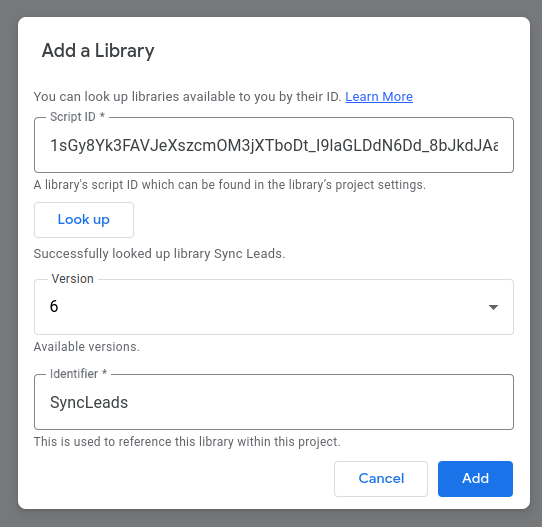

# Usage

## Requirements

Your Google Sheet must have the following format:

|    Submitted On     |       Name        |     Email      |      Phone      |          Message           |
|:-------------------:|:-----------------:|:--------------:|:---------------:|:--------------------------:|
| 03/15/2024 02:48:16 | Leonardo DiCaprio | leo@gmail.com  | +1 234 567-890  |                            |
| 03/15/2024 02:50:16 | Jennifer Aniston  | jenn@proton.me | +374 43-873-329 | Wanna buy a huge penthouse |

Otherwise, you should define **all** columns inside **columnsMapping** config (see available configuration section).

## Connect Google Script Library

1. Get access to our Google Script library by sending us an email address, that has access to Google Sheets with leads.
2. Open Google Sheet with leads and follow to `Extensions > Apps Script`.


3. Click `Libraries > +`.


4. Set Script ID: `1sGy8Yk3FAVJeXszcmOM3jXTboDt_I9laGLDdN6Dd_8bJkdJAa2HVKQD4` and press `Look up`.
   Choose the **latest** version, keep Identifier unchanged and press `Add`.



## Configure Script

Now you're ready to add a script to sync leads:


### Minimum configuration

```js
function main() {
    SyncLeads.syncLeads({
        // Insert your real organization ID here. (Required)
        orgId: '699ab1a6-c1e1-426d-bd16-be5d45676ad1',
    })
}
```

### Available configuration

```js
function main() {
    SyncLeads.syncLeads({
        orgId: '049162ac-4c6a-4093-8e6f-519085417e96',

        // Source ID that will be displayed in CRM. Default: Google Sheets Leads
        sourceId: 'Page #48329',
        // Enum value of source. Ask us to get information about available enum values. Default: website
        source: 'facebook',
        // ID of workflow, that should be assigned to new leads.
        workflowId: '049162ac-4c6a-4093-8e6f-519085417e96',
        // URL to send request to. Default: https://crm.mindall.co/api/api/lead/create/byExternalForm
        url: 'https://any-development-server.id/api/create-lead',
        // Number of column in which to find according information (starting with zero).
        // Either email or phone must present.
        // Default: name - 1, email - 2, phone - 3, notes - 4
        columnsMapping: {
            name: 5,
            email: null, // In case email is missing
            phone: 0,
            notes: 8,
       },
    })
}
```

## Run

1. Save script and press `Run`.
2. First time you will receive authorization request:


3. If you have `Google hasn't verified this app` error, simply click `Advanced`
   and `Go to <your porject name> (unsafe)`


4. After authorization script will be executed and this is an indicator that everything went smoothly:


5. Your Google Sheet with leads will be updated and a new column of sync statuses for every lead will appear.
   However, there might be some errors if lead information is invalid or not properly formatted.


6. How to fix these errors:
    - check execution log
      
    - change invalid lead fields
    - remove `Error` status on problematic lead row (make the status cell empty)
    - relaunch the script

## Set Up Continuous Execution

1. Go to `Triggers`:


2. Press `+ Add Trigger`.


3. Choose everything as in the screenshot and press `Save`.


4. That's all! Now the synchronization will repeat every minute and leads will be sent to CRM.
